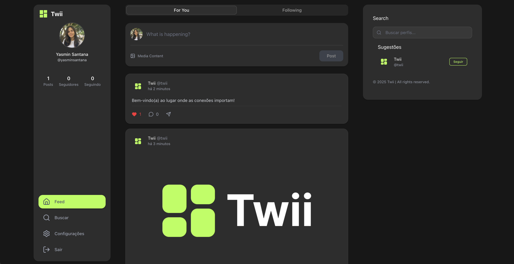
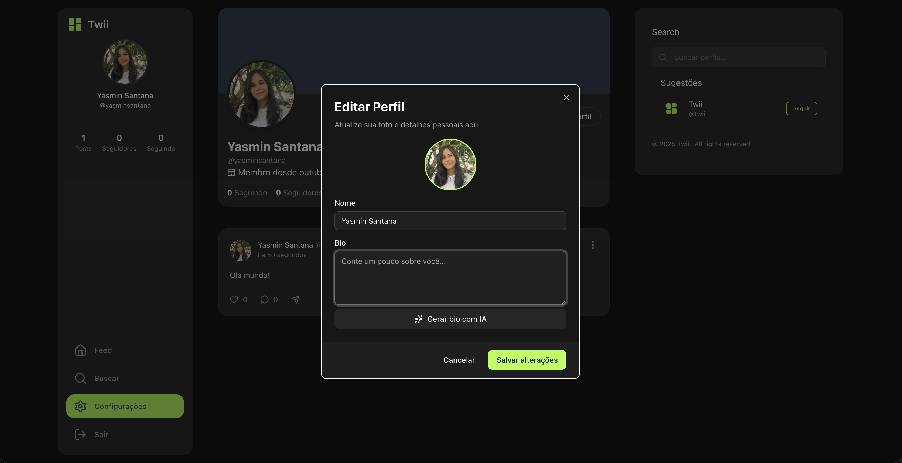

# Twii Social Front

<div align="center">
  
  
  <p>Uma plataforma de mídia social moderna construída com Next.js</p>

  <div>
    
    
    
  </div>
</div>

<p align="center">
  
  
</p>

## 📋 Índice

- [Visão Geral](#visão-geral)
- [Funcionalidades](#funcionalidades)
- [Tecnologias](#tecnologias)
- [Estrutura do Projeto](#estrutura-do-projeto)
- [Começando](#começando)
- [Uso](#uso)
- [Contribuição](#contribuição)

## 🌟 Visão Geral

Twii é uma plataforma de mídia social moderna que permite aos usuários compartilhar posts, comentar, seguir outros usuários e interagir com conteúdo. O projeto é construído com Next.js, React e TailwindCSS para uma experiência de usuário rápida e responsiva.

## ✨ Funcionalidades

<details>
<summary>Autenticação de Usuários</summary>
<ul>
  <li>Registro e login de usuários</li>
  <li>Verificação de email</li>
  <li>Gerenciamento de perfil</li>
</ul>
</details>

<details>
<summary>Feed Social</summary>
<ul>
  <li>Visualização de posts</li>
  <li>Criação de novos posts</li>
  <li>Comentários em posts</li>
  <li>Curtidas em posts</li>
</ul>
</details>

<details>
<summary>Interações Sociais</summary>
<ul>
  <li>Seguir/deixar de seguir usuários</li>
  <li>Visualizar perfis de usuários</li>
  <li>Buscar usuários e conteúdo</li>
</ul>
</details>

<details>
<summary>UI/UX</summary>
<ul>
  <li>Design responsivo</li>
  <li>Modo claro/escuro</li>
  <li>Animações suaves com Framer Motion</li>
  <li>Interface intuitiva</li>
</ul>
</details>

## 🚀 Tecnologias

- **Framework**: [Next.js 15](https://nextjs.org/)
- **UI**: [React 19](https://react.dev/)
- **Estilização**: [TailwindCSS 4](https://tailwindcss.com/)
- **Componentes**: [Radix UI](https://www.radix-ui.com/)
- **Animações**: [Framer Motion](https://www.framer.com/motion/)
- **Tema**: [next-themes](https://github.com/pacocoursey/next-themes)
- **Notificações**: [Sonner](https://sonner.emilkowal.ski/)
- **Data/Hora**: [date-fns](https://date-fns.org/)
- **Ícones**: [Lucide React](https://lucide.dev/)

## 📁 Estrutura do Projeto

<details>
<summary>Clique para expandir</summary>

```
src/
├── @types/              # Definições de tipos TypeScript
├── app/                 # Rotas e páginas da aplicação
│   ├── (auth)/          # Rotas de autenticação
│   ├── (main)/          # Rotas principais da aplicação
│   ├── @modal/          # Componentes de modal
│   ├── api/             # Rotas de API
│   ├── settings/        # Configurações do usuário
│   └── verify-email/    # Verificação de email
├── components/          # Componentes reutilizáveis
│   ├── ui/              # Componentes de UI básicos
│   └── ...              # Outros componentes específicos
├── hooks/               # Hooks personalizados
│   ├── auth/            # Hooks de autenticação
│   ├── comment/         # Hooks de comentários
│   ├── follow/          # Hooks de seguidores
│   ├── like/            # Hooks de curtidas
│   └── posts/           # Hooks de posts
├── lib/                 # Utilitários e configurações
└── utils/               # Funções utilitárias
```

</details>

## 🚦 Começando

### Pré-requisitos

- Node.js 18.0.0 ou superior
- npm ou yarn ou pnpm ou bun

### Instalação

1. Clone o repositório

   ```bash
   git clone https://github.com/santyasm/twii-social-front.git
   cd twii-social-front
   ```

2. Instale as dependências

   ```bash
   npm install
   # ou
   yarn
   # ou
   pnpm install
   # ou
   bun install
   ```

3. Configure as variáveis de ambiente
   ```bash
   cp .env.example .env.local
   # Edite .env.local com suas configurações
   ```

## 🎮 Uso

### Desenvolvimento

```bash
npm run dev
# ou
yarn dev
# ou
pnpm dev
# ou
bun dev
```

Acesse [http://localhost:3000](http://localhost:3000) no seu navegador para ver a aplicação.

### Build

```bash
npm run build
# ou
yarn build
# ou
pnpm build
# ou
bun build
```

### Produção

```bash
npm run start
# ou
yarn start
# ou
pnpm start
# ou
bun start
```

## 🤝 Contribuição

Contribuições são bem-vindas! Sinta-se à vontade para abrir issues ou enviar pull requests.

1. Faça um fork do projeto
2. Crie sua branch de feature (`git checkout -b feature/amazing-feature`)
3. Commit suas mudanças (`git commit -m 'Add some amazing feature'`)
4. Push para a branch (`git push origin feature/amazing-feature`)
5. Abra um Pull Request

---

<div align="center">
  <p>Desenvolvido com 💚 por Yasmin Santana</p>
</div>
